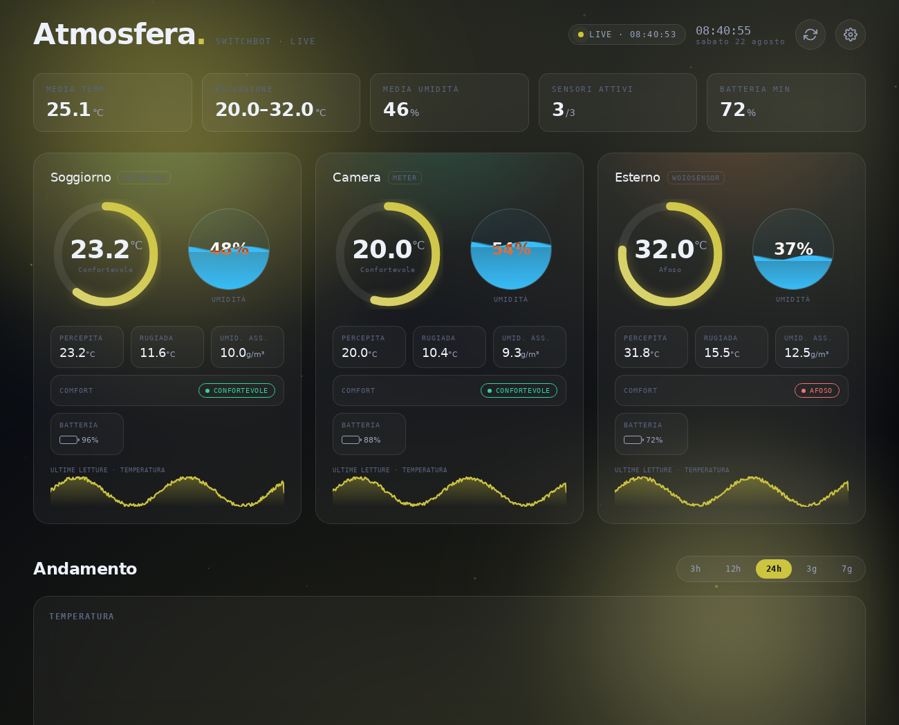
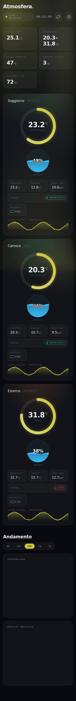

<div align="center">

# 🌤️ Atmosfera

### Dashboard meteo elegante e in tempo reale per i sensori SwitchBot

Una dashboard self-hosted che legge i termometri/igrometri **SwitchBot**, mostra i dati con grafica animata e calcola le grandezze derivate della fisica dell'aria — punto di rugiada, umidità assoluta, temperatura percepita e indice di comfort.




</div>

---

## Indice

- [Caratteristiche](#-caratteristiche)
- [Anteprima](#-anteprima)
- [Come funziona](#-come-funziona)
- [Requisiti](#-requisiti)
- [Installazione](#-installazione)
- [Configurazione](#-configurazione)
- [Avvio automatico (systemd)](#-avvio-automatico-systemd)
- [Grandezze derivate](#-grandezze-derivate)
- [Personalizzazione](#-personalizzazione)
- [Uso senza internet](#-uso-senza-internet)
- [Risoluzione problemi](#-risoluzione-problemi)
- [Struttura del progetto](#-struttura-del-progetto)
- [Sicurezza e privacy](#-sicurezza-e-privacy)
- [Roadmap](#-roadmap)
- [Contribuire](#-contribuire)
- [Licenza](#-licenza)

---

## ✨ Caratteristiche

- 🎨 **Sfondo "atmosfera" dinamico** — il cielo cambia colore in base alla temperatura media reale: indaco glaciale quando fa freddo, verde-menta in comfort, ambra/corallo quando fa caldo.
- 🌡️ **Una card per sensore** con gauge circolare della temperatura, indicatore di umidità a liquido animato, stato batteria e mini-grafico delle ultime letture.
- 🧮 **Grandezze derivate** calcolate al volo: punto di rugiada, umidità assoluta (g/m³), temperatura percepita (heat index) e indice di comfort.
- 📈 **Storico su grafici** interattivi (da 3 ore a 7 giorni), salvato in `history.json`.
- ⚡ **Dati in tempo reale** — cattura immediata all'apertura della pagina, più polling in background che continua a raccogliere anche a scheda chiusa.
- 🎛️ **Personalizzabile** — scegli quali informazioni mostrare, riordina le card trascinandole, imposta unità °C/°F e intervallo di interrogazione.
- 📱 **Responsive** — layout curato da desktop a smartphone.
- 💾 **Nessun database** — impostazioni e storico vivono in semplici file JSON.
- 🔒 **Secret al sicuro** — le credenziali restano sul server e non vengono mai inviate al browser.

## 📸 Anteprima

| Desktop | Mobile |
|:---:|:---:|
|  |  |

## 🧭 Come funziona

L'API SwitchBot richiede una **firma HMAC-SHA256** generata a partire dal `secret`. Per due motivi questa firma non può essere fatta nel browser:

1. il `secret` sarebbe visibile a chiunque apra i sorgenti della pagina;
2. il browser verrebbe comunque bloccato dal CORS chiamando `api.switch-bot.com`.

Per questo Atmosfera usa un piccolo **backend Flask** che firma le richieste, fa da proxy verso SwitchBot, calcola le grandezze derivate e salva impostazioni e storico su file. Il frontend (HTML/CSS/JS puro, con Chart.js per i grafici) interroga solo il backend locale.

```
Browser  ──►  Flask (firma + proxy)  ──►  api.switch-bot.com
   ▲                  │
   └── config.json / history.json (JSON su disco)
```

## 📦 Requisiti

**Sistema**
- Python 3.9 o superiore
- Un dispositivo sempre acceso su cui girare il servizio (ideale un Raspberry Pi)

**Account SwitchBot**
- App SwitchBot **v6.14 o superiore**
- **Cloud Services attivi** sull'Hub (i termometri comunicano via Bluetooth e passano dal cloud tramite l'hub)
- **Token** e **secret** dalle opzioni sviluppatore dell'app (vedi [Configurazione](#-configurazione))

**Sensori supportati:** Meter, Meter Plus, Meter Pro, Meter Pro (CO₂), sensore esterno WoIOSensor (Indoor/Outdoor IP65) e Hub 2.

## 🚀 Installazione

```bash
# 1. Clona il repository
git clone https://github.com/massiprofessor/atmosfera-switchbot.git
cd atmosfera-switchbot

# 2. Crea l'ambiente virtuale e installa le dipendenze
python3 -m venv venv
source venv/bin/activate
pip install -r requirements.txt

# 3. Avvia
python app.py
```

> **Nota:** su Raspberry Pi OS il comando è `python3` (non `python`). Dentro il virtualenv attivo `python` funziona regolarmente. Non serve `sudo`: l'app usa la porta 5001.

Apri quindi `http://<ip-del-dispositivo>:5001` dal browser. Se non conosci l'IP, `hostname -I` te lo mostra.

## ⚙️ Configurazione

Tutta la configurazione avviene dal **pannello Impostazioni** della dashboard: non serve modificare il codice.

### Ottenere token e secret

1. Apri l'app SwitchBot (v6.14+).
2. Vai su **Profilo → Preferenze → About**.
3. Tocca **10 volte** sulla voce *App Version*: comparirà **Developer Options**.
4. Entra in Developer Options e premi **Get Token**: otterrai `token` e `secret`.

### Collegare i sensori

1. Nella dashboard apri **Impostazioni** (icona ingranaggio).
2. Incolla `token` e `secret`, poi premi **Verifica credenziali**.
3. Premi **Scansiona i dispositivi**: Atmosfera individua da sola i sensori compatibili.
4. Salva. La prima lettura parte subito.

Le impostazioni vengono scritte in `config.json` (creato automaticamente al primo avvio).

## 🔧 Avvio automatico (systemd)

Per far partire Atmosfera all'accensione e riavviarla in caso di crash, usa il file `switchbot-dashboard.service` incluso.

```bash
# Copia e adatta il file al tuo percorso/utente
sudo cp switchbot-dashboard.service /etc/systemd/system/
sudo nano /etc/systemd/system/switchbot-dashboard.service
```

Sistema queste righe con i tuoi valori reali:

```ini
User=<il-tuo-utente>
WorkingDirectory=/percorso/della/cartella/atmosfera-switchbot
ExecStart=/percorso/della/cartella/atmosfera-switchbot/venv/bin/python app.py
```

`ExecStart` punta direttamente al Python del virtualenv, quindi il servizio non ha bisogno di "attivare" nulla. Poi:

```bash
sudo systemctl daemon-reload
sudo systemctl enable --now switchbot-dashboard
sudo systemctl status switchbot-dashboard      # deve risultare "active (running)"
```

Comandi utili:

```bash
sudo journalctl -u switchbot-dashboard -f       # log in tempo reale
sudo systemctl restart switchbot-dashboard      # riavvio dopo modifiche
```

> Assicurati che l'utente indicato in `User=` possa **scrivere** nella cartella (per `config.json` e `history.json`). Se necessario: `sudo chown -R <utente>:<utente> /percorso/della/cartella`.

## 📊 Grandezze derivate

Da temperatura e umidità relativa la dashboard calcola:

| Grandezza | Descrizione | Metodo |
|---|---|---|
| **Punto di rugiada** | Temperatura a cui l'aria si satura | Formula di Magnus |
| **Umidità assoluta** | Grammi d'acqua per m³ d'aria | Derivata dalla pressione di vapore |
| **Temperatura percepita** | Quanto "caldo" si sente davvero | Heat index (Rothfusz) sopra i 26 °C |
| **Indice di comfort** | Etichetta sintetica del benessere ambientale | Classificazione su temperatura + umidità |

## 🎛️ Personalizzazione

Dal pannello Impostazioni puoi:

- attivare/disattivare ogni singola informazione mostrata nelle card;
- riordinare le card **trascinandole**;
- scegliere °C o °F;
- impostare **ogni quanti secondi** interrogare i sensori;
- decidere se raccogliere dati anche a pagina chiusa;
- scegliere l'atmosfera (automatica dalla temperatura, scura fissa, mezzanotte);
- cancellare lo storico.

## 🌐 Uso senza internet

Chart.js e i font Google vengono caricati da CDN, quindi il dispositivo deve avere accesso a internet per i grafici e la tipografia. Se vuoi far girare tutto in una rete isolata, scarica quelle librerie e servile localmente da `static/`, poi aggiorna i riferimenti in `templates/index.html`. Le chiamate ai sensori passano comunque **sempre** dal cloud SwitchBot, che richiede connessione.

## 🧯 Risoluzione problemi

<details>
<summary><b><code>sudo: python: command not found</code></b></summary>

Su Raspberry Pi OS il binario è `python3`. E per questa app **non serve `sudo`**: usa `python3 app.py`, oppure attiva il virtualenv (`source venv/bin/activate`) e usa `python app.py`.
</details>

<details>
<summary><b><code>jinja2.exceptions.TemplateNotFound: index.html</code></b></summary>

Flask cerca i template in modo relativo ad `app.py`. Le cartelle `templates/` e `static/` devono trovarsi **accanto** ad `app.py`. Verifica con `find . -maxdepth 2 -type f` che la struttura sia intatta e che i nomi rispettino maiuscole/minuscole.
</details>

<details>
<summary><b>La pagina si apre ma resta sullo stato "Colleghiamo i tuoi sensori"</b></summary>

Non hai ancora inserito credenziali valide o non è stata fatta la scansione. Apri Impostazioni → inserisci token e secret → Verifica → Scansiona. Controlla anche che i **Cloud Services** siano attivi sull'Hub.
</details>

<details>
<summary><b>Il servizio non salva le impostazioni</b></summary>

Problema di permessi: l'utente del servizio non può scrivere nella cartella. Assegna la proprietà con `sudo chown -R <utente>:<utente> <cartella>`.
</details>

<details>
<summary><b>I grafici "Andamento" restano vuoti</b></summary>

Chart.js non è raggiungibile (nessun accesso a internet) oppure lo storico è ancora vuoto. Attendi qualche ciclo di polling e verifica la connessione, o servi Chart.js localmente (vedi [Uso senza internet](#-uso-senza-internet)).
</details>

## 🗂️ Struttura del progetto

```
atmosfera-switchbot/
├── app.py                       # Backend Flask: firma, scan, status, storico, derivati
├── requirements.txt
├── config.example.json          # Struttura di config.json (senza credenziali)
├── switchbot-dashboard.service  # Unità systemd
├── templates/
│   └── index.html               # Struttura della pagina + drawer impostazioni
├── static/
│   ├── css/style.css            # Atmosfera animata, gauge, glassmorphism, responsive
│   └── js/app.js                # Rendering, polling, grafici, impostazioni
└── docs/
    ├── screenshot-desktop.png
    └── screenshot-mobile.png
```

## 🔒 Sicurezza e privacy

- `config.json` contiene `token` e `secret` ed è **escluso da Git** tramite `.gitignore`: le tue credenziali non finiscono mai nel repository.
- Il `secret` non viene **mai** restituito al browser: l'endpoint di lettura della configurazione lo maschera.
- Tutti i dati restano sul **tuo** dispositivo: nessun servizio esterno oltre al cloud SwitchBot necessario per leggere i sensori.
- **Limite API SwitchBot:** 10.000 chiamate al giorno. Con 3 sensori e intervallo di 120 s sono circa 2.160 letture/giorno, ampiamente entro il limite.

## 🗺️ Roadmap

Idee per il futuro (contributi benvenuti):

- [ ] Chart.js e font serviti localmente per l'uso completamente offline
- [ ] Notifiche/soglie configurabili (es. umidità troppo alta)
- [ ] Esportazione dello storico in CSV
- [ ] Supporto ad altri sensori SwitchBot

## 🤝 Contribuire

Pull request e segnalazioni sono benvenute. Per modifiche importanti apri prima una *issue* per discuterne. 

1. Fai un fork del progetto
2. Crea un branch (`git checkout -b feature/nome`)
3. Commit delle modifiche (`git commit -m 'Aggiunge ...'`)
4. Push del branch (`git push origin feature/nome`)
5. Apri una Pull Request

## 📄 Licenza

Distribuito con licenza **MIT**. Vedi il file [`LICENSE`](LICENSE) per i dettagli.

---

<div align="center">
Realizzato con ❤️ per chi ama tenere d'occhio la propria aria.
</div>
